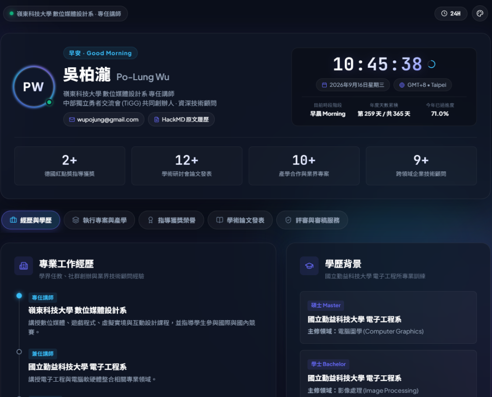

# 吳柏瀧 Po-Lung Wu | 個人數位履歷與即時儀表板

> 📌 **課堂作業 (Assignment):** DIC 1 (Do In Class 1)  
> 👤 **學生 / 作者 (Author):** 吳柏瀧 (Po-Lung Wu)  
> 🌐 **線上正式展示 (Live Demo):** [https://wupojung.github.io/](https://wupojung.github.io/)  
> 📦 **原始碼儲存庫 (Repository):** [https://github.com/wupojung/wupojung.github.io](https://github.com/wupojung/wupojung.github.io)  
> 📄 **資料來源 (HackMD CV):** [https://hackmd.io/@wupojung/polungwu-cv](https://hackmd.io/@wupojung/polungwu-cv)

---

## 📸 作業成果預覽 (Preview Screenshot)



---

## 📋 老師評分項目達成對照 (Requirements Checklist)

本專案完全對照老師公布之 **DIC 1 (Do In Class 1) 5 項基礎要求** 進行規格化建構：

| 評分項目 (Requirements) | 作業達成內容與實作位置 (Implementation Details) | 達成狀態 |
| :--- | :--- | :---: |
| **👤 1. Profile (個人資訊)**<br>• 姓名<br>• 個人照片或 Avatar<br>• 科系 / 專長<br>• 簡短自我介紹 | • **姓名**：吳柏瀧 (Po-Lung Wu)<br>• **Avatar**：專屬高科技立體「PW」Monogram 徽章與動態極光光環（遵循隱私保護不放個人照片）<br>• **科系與專長**：嶺東科技大學 數位媒體設計系 專任講師 · 國立勤益科技大學 電子工程所碩士<br>• **簡短自我介紹**：首頁顯著展示自介，說明個人專注於 IoT、數位雙生、電腦圖學與大型系統架構實務經驗 | ✅ 100% 達成 |
| **🛠 2. Skills (專業技能)**<br>• 至少列出 3 項技能<br>• 例如：Python, C/C++, IoT, Web, AI | • **程式語言**：`Python`, `C / C++`, `C# (Unity)`, `JavaScript (ES6+)`, `SQL`<br>• **物聯網與 AI**：`IoT (MQTT / Modbus)`, `AI & 電腦視覺 (Computer Vision)`, `Machine Learning`<br>• **多媒體與互動**：`電腦圖學 (Computer Graphics)`, `數位雙生 (Digital Twin)`, `VR / AR`, `Unity 遊戲開發`<br>• **網頁與系統**：`Web Development`, `WebAPI & LINE Bot`, `CI/CD (Jenkins + Git)` | ✅ 超額達成<br>(15+ 項專業技能) |
| **🚀 3. Projects (作品與專案)**<br>• 至少介紹 1 個作品或專案<br>• 包含專案名稱、描述、使用技術、GitHub Link | • **MQTT 物聯網環境監測系統**：使用技術 `Python`, `MQTT`, `IoT`, `WebAPI`（附工研院課程與 GitHub 連結）<br>• **WebAPI 與 LINE 機器人開發**：使用技術 `JavaScript`, `RESTful WebAPI`, `LINE Bot`<br>• **Modbus 工業物聯網協定入門**：使用技術 `C / C++`, `Python`, `Modbus RTU/TCP`<br>• **十大重點產業 AI 虛擬主持人**：使用技術 `Unity`, `AI`, `Motion Capture`<br>• **中彰投智慧交通維運平台** & **智慧車牌辨識系統**：使用技術 `Python`, `OpenCV`, `C++`<br>• 每個專案卡片均具備完整的【專案名稱】、【專案說明】、【使用技術標籤】與【GitHub Link】 | ✅ 超額達成<br>(收錄 6+ 個核心作品) |
| **🕐 4. Live Clock (即時時鐘)**<br>• 使用 JavaScript 製作<br>• 至少顯示 HH : MM : SS<br>• 時間必須自動更新 | • 原生 JavaScript (`setInterval`) 秒級高精度自動更新<br>• 醒目呈現數位時鐘 `HH : MM : SS`，具備外圈秒數動態進度環<br>• 支援 `12H (AM/PM)` 與 `24H` 格式一鍵即時切換<br>• 整合時段階段動態問候（早安/午安/傍晚好/夜深了）、台灣在地化日期、時區（GMT+8）與年度累積進度 | ✅ 100% 達成 |
| **🎨 5. Personal Design (自訂風格)**<br>• 非直接複製老師網頁<br>• 利用 Antigravity 與 AI 修改風格<br>• 顏色、字型、背景、佈局、卡片、動畫、主題 | • **視覺美學**：精緻毛玻璃 (Glassmorphism) 深色模式，搭配後方漂浮動態極光漸層光球 (CSS Keyframes Animation)<br>• **精選字型**：Google Fonts 之 `Plus Jakarta Sans`、`Noto Sans TC` 與數位時鐘專用 `JetBrains Mono`<br>• **卡片與佈局**：主儀表板 + 五大分類頁籤（經歷學歷、作品專案、紅點獲獎、12篇論文、評審審稿）<br>• **多主題配色**：極光紫藍 (Aurora)、曜石黑綠 (Midnight)、賽博夕陽 (Cyber) 隨心切換<br>• **抗折行防護**：時間容器經過嚴格 `white-space: nowrap` 與 RWD 響應式優化，各解析度下皆維持優雅單行 | ✅ 100% 達成 |

---

## 🧭 功能結構導覽 (Interactive Architecture)

```
├── 頂部功能列 (Top Navigation)
│   ├── 系統身分狀態燈 (嶺東科大 數位媒體設計系 · 專任講師)
│   ├── 12H / 24H 時間格式一鍵切換鈕
│   └── 3 款主題配色輪播切換鈕 (Aurora / Midnight / Cyber)
├── 主儀表板 (Hero Dashboard)
│   ├── 左側 Profile：PW 科技頭像、動態時段問候、姓名、簡短自我介紹、Email、GitHub、HackMD
│   ├── 右側 Live Clock：充足寬度即時時鐘 (HH:MM:SS)、秒數進度環、在地化日期、時區、天數進度
│   └── 數據條：德國紅點獲獎 2+、論文 12+、產學專案 10+、企業顧問 9+
└── 五大分類頁籤 (Interactive Tabs)
    ├── 💼 經歷與學歷：任教經歷、TiGG 創辦、業界顧問時間軸、勤益科大電子所碩士與學士背景
    ├── 🛠️ 執行專案與產學：經濟部計畫(84萬)、3門 iPAS 數位課程、智慧交通警政與王品商用系統 (附使用技術與 GitHub Link)
    ├── 🏆 指導學生獲獎：德國紅點設計獎 2 項 Winner、巴哈姆特 ACG 特別獎、放視大賞入圍
    ├── 📚 學術研討會論文：12 篇學術論文 (Unity CI/CD、虛擬藝廊、XR教具、數位雙生、IEEE IS3C EI 收錄)
    └── ⚖️ 評審與審稿服務：Taipei Game Show Indie Game Award 評審委員、研討會審稿人 (Reviewer)
```

---

## 🛠️ 技術架構說明 (Tech Stack)

| 類別 | 使用技術 | 特點說明 |
| :--- | :--- | :--- |
| **網頁結構** | HTML5 | 完整語義化標籤（`<header>`, `<main>`, `<section>`, `<nav>`, `<footer>`）與無障礙設計 |
| **視覺樣式** | Vanilla CSS3 | CSS 自訂屬性變數、Glassmorphism 毛玻璃質感、Keyframes 漂浮光球動態、Flexbox & CSS Grid |
| **邏輯控制** | Vanilla JavaScript | 原生 `setInterval` 即時時鐘運算、時區推算、LocalStorage 本地偏好記憶、頁籤互動切換 |
| **字體排印** | Google Fonts | Plus Jakarta Sans、Noto Sans TC、JetBrains Mono |
| **向量圖示** | Lucide Icons | 輕量高質感 SVG 向量圖示庫 |
| **外觀圖示** | Inline SVG Favicon | 專屬客製化「PW」微型分頁圖示 |

---

## 💻 本地執行指南 (Local Development)

本專案為零依賴純前端靜態站點，可透過任何方式直接開啟：

### 方式 1：直接開啟
直接雙擊 [index.html](file:///d:/8115056006/aiot/index.html) 即可於任一瀏覽器（Chrome, Edge, Safari, Firefox）瀏覽。

### 方式 2：使用 Python 內建輕量 HTTP 伺服器
```bash
# 在專案目錄下執行
python -m http.server 5173
```
在瀏覽器網址列輸入：`http://localhost:5173`。

### 方式 3：使用 Node.js / npx
```bash
npx serve .
```

---

## 🚀 GitHub Pages 部署流程 (Deployment)

1. **提交並推送變更至 GitHub**：
   ```bash
   git add .
   git commit -m "feat: complete DIC 1 assignment deliverable strictly matching rubric"
   git push origin main
   ```
2. **開啟 GitHub Pages 服務**：
   - 進入 GitHub 儲存庫 `wupojung/wupojung.github.io` 的 **Settings** -> **Pages**。
   - 在 **Build and deployment** 下的 **Branch** 選擇 `main` 分支、資料夾選擇 `/ (root)`，點擊 **Save**。
3. **驗收成果**：
   - 約 1~2 分鐘建置完成後，即可於 [https://wupojung.github.io/](https://wupojung.github.io/) 查驗線上站點。

---

## 📬 學生 / 作者資訊 (Contact)

- **作者姓名：** 吳柏瀧 (Po-Lung Wu)
- **現任職務：** 嶺東科技大學 數位媒體設計系 專任講師
- **社群職務：** 中部獨立勇者交流會 (TiGG) 共同創辦人
- **電子信箱：** [wupojung@gmail.com](mailto:wupojung@gmail.com)
- **GitHub：** [https://github.com/wupojung](https://github.com/wupojung)
- **詳細履歷：** [HackMD 線上版](https://hackmd.io/@wupojung/polungwu-cv)
- **作業項目：** DIC 1 (Do In Class 1)
